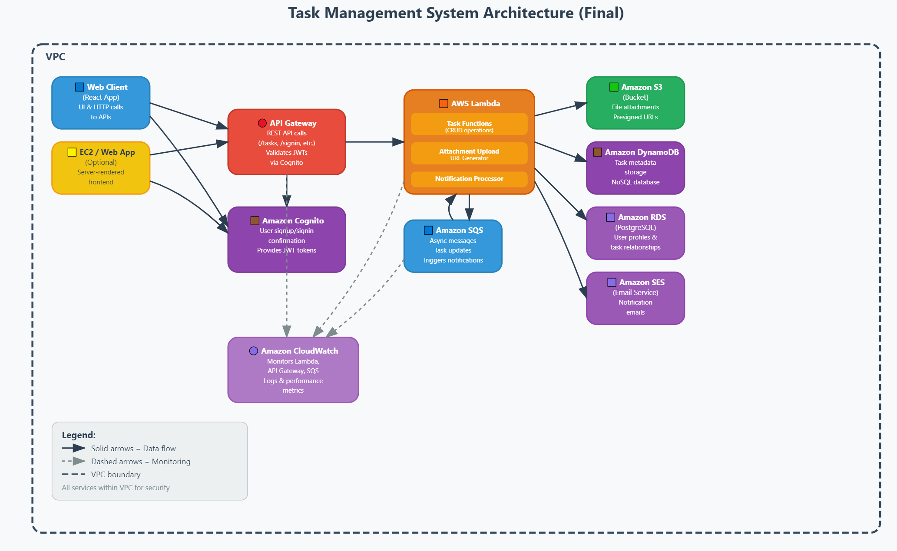

# Cloud Task Manager

A production-ready, feature-complete task management system built entirely on AWS.

## Architecture Diagram



### Architecture Components Explained

#### Web Client (React App)
- Single-page application built with React
- Provides intuitive UI for task management
- Makes authenticated HTTP requests to API Gateway endpoints
- Handles file uploads directly to S3 using pre-signed URLs
- Manages user authentication state through Cognito tokens

#### API Gateway
- RESTful API interface serving multiple endpoints:
  - `/signup`, `/signin`, `/confirm` for authentication
  - `/tasks` for task CRUD operations
  - `/tasks/{id}/attachment` for file upload functionality
- Validates JWT tokens issued by Cognito
- Enforces API authorization through Cognito authorizers
- Routes requests to appropriate Lambda functions

#### Amazon Cognito
- Manages complete user authentication workflow
- Handles user registration, email confirmation, and sign-in
- Issues secure JWT tokens for authenticated API requests
- Integrates with the web client through Amplify libraries
- Provides secure user pools and identity pools

#### AWS Lambda
- **Task Functions**: Handle all task CRUD operations
  - Create new tasks
  - Retrieve tasks for authenticated users
  - Update existing task properties
  - Delete tasks and their associated resources
- **Attachment Upload**: Generates secure pre-signed S3 URLs
  - Creates temporary, single-use upload URLs
  - Ensures secure direct upload to S3
  - Associates uploaded files with specific tasks
- **Notification Processor**: 
  - Consumes messages from SQS queue
  - Formats notification content
  - Triggers SES email alerts for task events

#### Amazon S3
- Securely stores all task attachments
- Enforces access control via bucket policies
- Provides pre-signed URLs for secure temporary access
- Integrates with Lambda for automated file management

#### Amazon DynamoDB
- NoSQL database storing task metadata
- Offers high-performance, scalable data storage
- Maintains task-to-user relationships
- Enables efficient queries based on user ID

#### Amazon RDS (PostgreSQL)
- Relational database for complex data relationships
- Stores user profiles and detailed task information
- Ensures data integrity through relational constraints
- Secured within VPC and accessed via Lambda functions

#### Amazon SQS
- Queues task events (creation, updates, deletion)
- Decouples task operations from notification processing
- Ensures reliable message delivery
- Integrates with Lambda for message processing

#### Amazon SES
- Sends email notifications for task events
- Delivers customized alerts based on task changes
- Provides delivery metrics and tracking
- Configured with verified sender domains

#### Amazon CloudWatch
- Monitors Lambda function performance
- Tracks API Gateway request metrics
- Maintains comprehensive logs across all services
- Enables performance optimization and troubleshooting

#### VPC Boundary
- Contains all sensitive services within secure network
- Enforces network-level access controls
- Protects RDS and internal Lambda functions
- Implements security groups and network ACLs

## Setup Guide (AWS Deployment Instructions)

### Prerequisites
- AWS CLI installed and configured with appropriate credentials
- Node.js (v14+) and npm/yarn
- Serverless Framework installed globally (`npm install -g serverless`)

### Step 1: Clone the Repository
```bash
git clone https://github.com/yourusername/cloud-taskmgr.git
cd cloud-taskmgr
```

### Step 2: Install Dependencies
```bash
# Install backend dependencies
cd backend
npm install

# Install frontend dependencies
cd ../frontend
npm install
```

### Step 3: Configure Environment Variables

Create a `.env` file in the backend directory with the following variables:

```
TASKS_TABLE=CloudTaskManager-tasks
ATTACH_BUCKET=cloud-taskmgr-attachments-122610479020rdgdr
USER_POOL_ID=us-east-1_OAush5WW0drgdrg
USER_POOL_CLIENT=2e57revu20opqsvg7ubq0h1op1rgrgdr
IDENTITY_POOL_ID=us-east-1:98cb4c16-b1a6-4f97-99ad-f486172ea36adrgdr
NOTIF_QUEUE_URL=https://sqs.us-east-1.amazonaws.com/123456789012/task-notificationsdrgdr
DB_CLUSTER_ARN=arn:aws:rds:us-east-1:123456789012:cluster:taskmgr-dbddrgdr
DB_SECRET_ARN=arn:aws:secretsmanager:us-east-1:123456789012:secret:taskmgr-db-credentialsdrgdr
DB_NAME=taskmgrdb
SES_FROM_EMAIL=notifications@yourdomain.com
```

### Step 4: Deploy Backend Services

Deploy all Lambda functions, API Gateway, and other AWS resources using the Serverless Framework:

```bash
cd backend
serverless deploy --stage prod
```

This command will:
- Create Lambda functions for all task operations
- Set up API Gateway with all required routes
- Configure DynamoDB tables
- Create and configure S3 buckets
- Set up SQS queues
- Configure necessary IAM roles and permissions

### Step 5: Set Up Cognito Resources

The Serverless deployment will create Cognito resources, but you need to note the IDs:

```bash
aws cognito-idp list-user-pools --max-results 20

# Note the USER_POOL_ID from the output

aws cognito-idp list-user-pool-clients --user-pool-id YOUR_USER_POOL_ID

# Note the CLIENT_ID from the output
```

### Step 6: Configure Frontend

Update the `src/aws-config.js` file in the frontend directory:

```javascript
export const awsConfig = {
  Auth: {
    Cognito: {
      userPoolId: 'us-east-1_OAush5WW0',
      userPoolClientId: '2e57revu20opqsvg7ubq0h1op1',
      loginWith: {
        email: true,
        phone: false,
        username: true
      }
    }
  },
  API: {
    REST: {
      CloudTaskMgrAPI: {
        endpoint: 'https://y2ex88b9x1.execute-api.us-east-1.amazonaws.com/dev',
        region: 'us-east-1'
      }
    }
  },
  Storage: {
    S3: {
      bucket: 'cloud-taskmgr-attachments-122610479020',
      region: 'us-east-1'
    }
  }
};
```

### Step 7: Deploy Frontend

#### Option 1: Deploy to EC2

1. Build the React application:
   ```bash
   cd frontend
   npm run build
   ```

2. Transfer the build to your EC2 instance:
   ```bash
   scp -i your-key.pem -r build/* ec2-user@your-instance-ip:/var/www/html/
   ```

3. Ensure your EC2 has a web server (like nginx) configured to serve the files.

#### Option 2: Deploy to S3 with CloudFront (Recommended)

1. Create an S3 bucket for web hosting:
   ```bash
   aws s3 mb s3://your-app-bucket-name
   ```

2. Build and upload the application:
   ```bash
   cd frontend
   npm run build
   aws s3 sync build/ s3://your-app-bucket-name --acl public-read
   ```

3. Create a CloudFront distribution pointing to your S3 bucket for improved performance.

### Step 8: Verify Deployment

1. Access your deployed application through the EC2 or CloudFront URL
2. Create a test user in Cognito
3. Sign in and verify you can create, update, and delete tasks
4. Test file uploads by attaching files to tasks
5. Verify email notifications are being sent for task events

### IAM Permissions

The following IAM permissions are required for the Lambda functions:

```json
{
  "Version": "2012-10-17",
  "Statement": [
    {
      "Effect": "Allow",
      "Action": [
        "dynamodb:PutItem",
        "dynamodb:GetItem",
        "dynamodb:UpdateItem",
        "dynamodb:DeleteItem",
        "dynamodb:Query",
        "dynamodb:Scan"
      ],
      "Resource": "arn:aws:dynamodb:us-east-1:*:table/CloudTaskManager-tasks"
    },
    {
      "Effect": "Allow",
      "Action": [
        "s3:PutObject",
        "s3:GetObject",
        "s3:DeleteObject"
      ],
      "Resource": "arn:aws:s3:::cloud-taskmgr-attachments-*/*"
    },
    {
      "Effect": "Allow",
      "Action": [
        "sqs:SendMessage",
        "sqs:ReceiveMessage",
        "sqs:DeleteMessage"
      ],
      "Resource": "arn:aws:sqs:us-east-1:*:task-notifications"
    },
    {
      "Effect": "Allow",
      "Action": [
        "ses:SendEmail",
        "ses:SendRawEmail"
      ],
      "Resource": "*"
    },
    {
      "Effect": "Allow",
      "Action": [
        "logs:CreateLogGroup",
        "logs:CreateLogStream",
        "logs:PutLogEvents"
      ],
      "Resource": "arn:aws:logs:us-east-1:*:*"
    },
    {
      "Effect": "Allow",
      "Action": [
        "rds-data:ExecuteStatement",
        "rds-data:BatchExecuteStatement"
      ],
      "Resource": "arn:aws:rds:us-east-1:*:cluster:taskmgr-db"
    },
    {
      "Effect": "Allow",
      "Action": [
        "secretsmanager:GetSecretValue"
      ],
      "Resource": "arn:aws:secretsmanager:us-east-1:*:secret:taskmgr-db-credentials*"
    }
  ]
}
```

## User Manual

### Getting Started

#### Sign Up & Login

1. Access the Cloud Task Manager application via your browser
2. Click the "Sign Up" button to create a new account
3. Enter your email address, username, and password
4. Check your email for a verification code
5. Enter the verification code to confirm your account
6. Log in with your username and password

### Task Management

#### Creating a Task

1. After logging in, you'll see your task dashboard
2. Click the "Create a Task" button
3. Enter a title for your task
4. Set a due date (optional)
5. Click "Create" to save your new task

#### Updating a Task

1. Locate the task you want to modify
2. Click the "Edit" button on the task card
3. Update the title and/or due date
4. Click "Save" to apply your changes

#### Deleting a Task

1. Locate the task you want to remove
2. Click the "Delete" button on the task card
3. Confirm deletion when prompted
4. The task will be permanently removed

### File Attachments

#### Uploading Attachments

1. Navigate to the task where you want to add an attachment
2. In the task card, locate the "Add Attachment" section
3. Click the file selector and choose a file from your device
4. The file will automatically upload and be associated with your task

#### Viewing Attachments

1. Attachments appear within their associated task card
2. Click on the attachment name to download or view it

### Email Notifications

Cloud Task Manager automatically sends email notifications for the following events:

- **Task Creation**: When you create a new task
- **Task Updates**: When task details are modified
- **Task Deletion**: When a task is removed
- **Approaching Due Dates**: 24 hours before a task is due

Email notifications include:
- Task details (title, due date)
- Information about what changed
- A direct link to view the task (when applicable)

Notifications are sent to the email address associated with your account.

---
